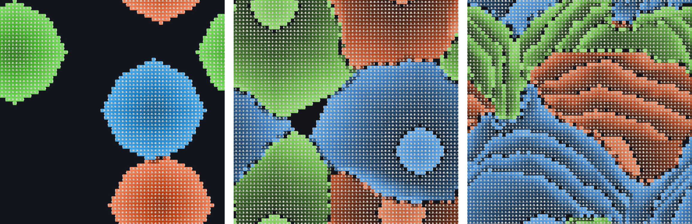

# CA Sim

### TL;DR

This is not Bend2 and not Bend running in the browser.

It uses the Bend CLI locally (Bend1 prototype) with a TypeScript + Canvas web UI.

⚠️ Live loop runs on the JS reference engine

Bend is integrated for parity/benchmarking validation when the Bend CLI is installed.

What I would like to acchieve: move the live loop to Bend.



## What this is NOT

- It is not Bend2.
- It is not Bend running in the browser.
- It is not 100% Bend in the live runtime loop. ⚠️

## What this IS

- A simulation project with a Bend kernel.
- A web interface built with TypeScript + Canvas.
- Today, the Live simulation loop runs on the JS reference engine ⚠️
- Bend is integrated in parity/benchmarking validation (when installed).
- The goal is to plug Bend in as a live backend too.

## V1 Control Contract (Backend-neutral)

The control semantics below are the project contract for any live backend (JS now, Bend live later):

- `Start`: if no run exists, create and start; if paused, resume same run; if already running, no-op.
- `Pause`: pauses only when running; otherwise no-op.
- `Resume`: resumes only when paused; otherwise no-op.
- `Reset`: valid only when a run exists; rebuilds same seed+config and preserves play state.
- `Reset` with no run: explicit server error (and disabled in main UI).
- `Step`: kept as debug API compatibility, hidden from V1 main UI.
- Server is source of truth for run phase (`idle|running|paused`) and run state.

Session continuity:

- Viewer uses a persistent `clientId` (localStorage) and reconnects with `?clientId=...`.
- Bridge keeps session state by `clientId` (default retention: 15 minutes).
- Simulation does not advance while client is disconnected.
- Reconnect with same `clientId` restores phase + last frame deterministically.

## Simulation Rules

### Energy scale

Internal values use tenths (`energy10`):

| Internal (`energy10`) | Human value |
| --- | --- |
| 50 | 5.0 |
| 49 | 4.9 |
| 40 | 4.0 |
| 1 | 0.1 |
| 0 | 0.0 (cell dies) |

### Neighborhood and battle rules

| Theme | Human rule | Current default |
| --- | --- | --- |
| Neighborhood | Each cell checks the 8 surrounding neighbors. | 8 neighbors |
| Map edges | World wraps around at borders. | `wrapWorld = true` |
| Type advantage | Water beats Fire, Fire beats Grass, Grass beats Water. | Fixed |
| Birth trigger | Empty cell can spawn if a type reaches threshold in neighbors. | `reproThreshold = 3` |
| Spawn energy | Newborn starts with spawn energy. | `spawnEnergy10 = 50` (5.0) |
| Newborn age | Newborn starts at age zero. | `age = 0` |
| Aging drain | Alive cell loses 0.1 energy every tick. | Fixed at `1` in `energy10` |
| Threat penalty | Each threatening neighbor removes energy. | `threatPenalty10 = 10` (1.0) |
| Ally bonus | Same-type neighbors can add energy. | `allyBonus10 = 0` |
| Prey bonus | Neighbors you beat can add energy. | `preyBonus10 = 0` |
| Max energy | Energy cannot exceed cap. | `maxEnergy10 = 50` (5.0) |
| Death | Cell dies when energy reaches zero. | type -> empty, energy -> 0, age -> 0 |
| Surviving tick | Surviving cell gets older. | `age += 1` |

### Per-tick formula (alive cell)

```txt
delta10 =
  -(threats * threatPenalty10)
  + (allies * allyBonus10)
  + (prey * preyBonus10)
  - 1

nextEnergy10 = clamp(currentEnergy10 + delta10, 0, maxEnergy10)
```

Notes:

- The fixed `-1` is the mandatory aging drain (`-0.1` human scale).
- Newborn cells do not take aging drain on the birth tick.

## Workspace layout

- `packages/contracts`: shared types and defaults
- `engine/reference`: deterministic SoA fixed-point reference engine
- `engine/bend`: Bend runtime wrapper and Bend kernel template
- `apps/bridge`: WebSocket control + frame streaming service
- `apps/viewer`: Vite + TypeScript Canvas client
- `scripts`: parity and benchmark orchestrators

## Getting started

```bash
npm install
npm run dev:bridge
npm run dev:viewer
```

Bridge default: `ws://localhost:8787`  
Viewer default: `http://localhost:5173`

## Verification commands

```bash
npm run test
npm run parity
npm run bench
```

`parity` and `bench` always run JS reference checks. Bend comparisons (`run-rs`, `run-c`) are attempted when `bend` is installed.
